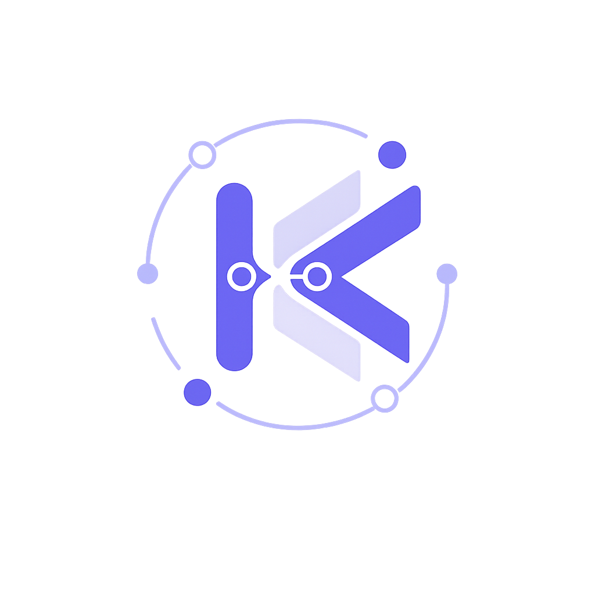
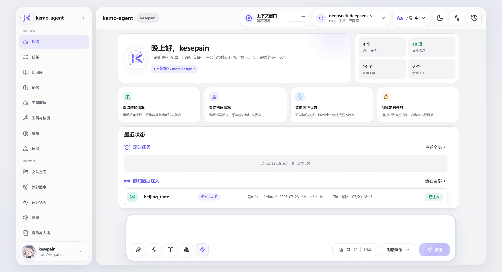

# kemo-agent

<p align="center">
  
</p>

<p align="center">
  <a href="readme.md">简体中文</a> · <strong>English</strong>
</p>

<p align="center">
  <strong>A local multi-user Agent Runtime for the next generation of personal intelligence infrastructure.</strong>
</p>

<p align="center">
  Built around the Kemo Tidal Engram lifecycle memory system, kemo-agent orchestrates context, subagents, tools, environmental perception, external extensions, and cross-platform interaction,<br>
  enabling agents to develop long-term cognition, evolve continuously, schedule complex work, and connect with the real world.
</p>

<p align="center">
  <a href="https://github.com/kesepain-KE/kemo-agent"></a>
  <a href="LICENSE"></a>
  <a href="https://kesepain-ke.github.io/kemo-agent-doc/"></a>
</p>

---

## What if every conversation did not have to start over?

Many AI assistants exist only inside the current window.

Close the window, and the relationship resets. Your preferences, ongoing work, previous decisions, and the details you repeatedly emphasized may all disappear by the next time you meet.

kemo-agent is trying to build a different kind of agent.

It does not treat every exchange as an isolated question and answer. Instead, it connects the time you spend together into a continuous line. A goal discussed today can continue tomorrow. A plan left weeks ago can resurface when it becomes relevant. Information that truly matters can gradually become part of the context through which the agent understands you.

It is more than a window that answers questions. It is closer to a personal intelligence workspace that you control.

---

## Memory moves like the tide

Human memory is not a warehouse filled with untouched records.

Some words matter only in the moment and quietly fade as the tide recedes. Some things are mentioned again and again, leaving clearer traces with every rise and fall. Other people and decisions remain worth remembering even after a long time.

That is the experience **Kemo Tidal Engram** is designed to create.

kemo-agent does not try to remember everything mechanically. Over long-term use, it attempts to distinguish what relates to you, what still matters, and what should return at the right moment.

You always retain the ability to inspect, supplement, and correct its memories. Memory is not a hidden black-box judgment; it is something you and the agent maintain together.

> The tide carries brief echoes away, but leaves what truly matters on the shore.

---

## What can it help you do?

| Scenario | What kemo-agent provides |
|---|---|
| Everyday conversation | Continue with your communication style, preferences, and long-term interests without repeatedly explaining the background |
| Memory consolidation | Let important information remain, reinforce what is repeatedly mentioned, and allow outdated details to fade quietly |
| Complex tasks | Turn an ambiguous goal into a clear plan and keep track of its steps and results |
| Long-running projects | Preserve key decisions, unfinished work, and phase changes so work can resume at any time |
| Scheduled assistance | Execute tasks, organize information, or send reminders at an agreed time, even while you are offline |
| Knowledge collaboration | Work with personal or team materials so responses stay grounded in the real working environment |
| Deeper reasoning | Spend more effort on difficult problems while responding quickly to simple ones |
| Subagent collaboration | Delegate memory organization, planning, scheduling, and other specialized judgments to focused subagents |
| External access | Stay connected to the same agent through the web, command line, or messaging platforms |
| File exchange | Receive user materials and organize generated results and temporary files |
| Environmental awareness | Combine authorized information sources so the agent can understand its current environment |
| Extensible capabilities | Add tools, skills, perception sources, and external integrations as needed |

These capabilities are not isolated feature entries. They serve one shared goal: helping the agent understand what is happening and keep work moving forward.

---

## A complete personal intelligence workspace

The kemo-agent web interface is organized around real workflows rather than a single input box.

From one place, you can:

- hold streaming conversations and add text, image, audio, video, or file guidance while a run is in progress;
- search, switch, save, and manage conversation history;
- inspect and edit memories to maintain long-term cognition;
- manage personal, shared, and global knowledge;
- create, approve, pause, and resume task plans;
- schedule one-time or recurring tasks;
- inspect tools, skills, perception sources, and extension capabilities;
- manage uploaded files, generated outputs, and temporary content;
- check external messaging connections and current runtime status;
- keep separate data and workspaces for different users.

Even very long conversations do not require loading the entire history at once. The web interface displays recent content first and loads older messages when you scroll upward, keeping long-running conversations lightweight.

<p align="center">
  
</p>

---

## The same agent through more than one interface

You can have an extended conversation in the browser, handle local work quickly from the command line, or send a message from a connected messaging platform.

The interface may change, but the user identity, conversation history, memories, and authorized resources still belong to the same person. kemo-agent aims to reduce the fragmentation of having to “meet again” whenever you switch platforms, allowing the agent to become a persistent personal interface.

Scheduled tasks are part of that continuity as well. While you are offline, the agent can wake at an agreed time, complete the work entrusted to it, and leave behind a result you can review later.

---

## Complex work can be completed gradually

When a goal requires multiple steps, kemo-agent can confirm a plan with you before taking action.

You can see where the task is, what has been completed, and what remains. You can also pause midway, reconsider the direction, and decide whether to continue.

The emphasis is not on uncontrolled “full automation,” but on a collaboration process that remains understandable, interruptible, and resumable.

Some work should be completed immediately, some needs several rounds of interaction, and some belongs at a future time. kemo-agent is designed to let all three rhythms coexist naturally in one workspace.

---

## Your data should remain under your control

kemo-agent is local-first.

Conversations, memories, knowledge, tasks, and user files are managed in your workspace, where they can be inspected, backed up, and migrated. Different users remain clearly separated, and each user controls which resources may be used.

The project does not claim that every model service is inherently private. What is sent to an external service depends on the provider, configuration, and authorization scope you choose. kemo-agent's role is to return as much choice and visibility to the user as possible.

---

## Get started

> 📖 For complete installation, configuration, usage, and extension-development guidance, visit the **[kemo-agent online documentation](https://kesepain-ke.github.io/kemo-agent-doc/)**. The documentation site is currently available in Chinese.

### Choose an installation method

Windows, Linux, npm, and Docker share the framework version. The current formally finalized version is **1.4.0**; the compatible gateway baseline is **1.0.0**.

> **Publication prerequisite:** The remote commands below work only after the installer scripts and the corresponding distribution artifacts are published. Native installation needs `kemo-agent-release-<version>.zip` and its `.zip.sha256` in a Release; npm needs a published distribution package; Docker needs a published image tag. Pushing code alone does not publish these artifacts. This guide does not claim they are already available online. The Release ZIP is not GitHub's automatically generated source archive.

| Method | Host requirements |
|---|---|
| Windows / Linux one-command deployment | Python 3.10+; working `venv` / `ensurepip` on Linux; network access to install application dependencies |
| npm | Node.js 18+, npm, Python 3.10+, and a working Python virtual environment |
| Docker | Docker Engine and Docker Compose; no host Python / Node.js required |
| Source development | Python 3.10+, Git, Node.js and npm for frontend builds |

The Release includes a prebuilt frontend, so native Windows / Linux clients do not need Git or Node.js. Remote installers execute code; download and review them first if preferred.

### Windows: install, start, and update

Install in PowerShell:

```powershell
irm https://raw.githubusercontent.com/kesepain-KE/kemo-agent/main/deploy/windows/install.ps1 | iex
```

The installer installs files and dependencies but does not start a persistent service. The default directory is `%USERPROFILE%\.kemo-agent`. For everyday use:

```powershell
python "$env:USERPROFILE\.kemo-agent\deploy\deploy.py" start
# Check only; this does not install updates
python "$env:USERPROFILE\.kemo-agent\deploy\deploy.py" check
# Stop the running application before updating and restarting
python "$env:USERPROFILE\.kemo-agent\deploy\deploy.py" update --yes
python "$env:USERPROFILE\.kemo-agent\deploy\deploy.py" start
```

If only the `py` launcher is available, replace `python` with `py -3`. First startup initializes configuration and the user. The installer does not install system Python, change PATH, or create a system service.

### Linux: install, start, and update

```sh
curl -fsSL https://raw.githubusercontent.com/kesepain-KE/kemo-agent/main/deploy/linux/install.sh | sh
python3 "$HOME/.kemo-agent/deploy/deploy.py" start
```

For routine checks and updates:

```sh
python3 "$HOME/.kemo-agent/deploy/deploy.py" check
# Stop the running application first
python3 "$HOME/.kemo-agent/deploy/deploy.py" update --yes
python3 "$HOME/.kemo-agent/deploy/deploy.py" start
```

The default directory is `~/.kemo-agent`. macOS can reuse the Unix entry point, but on-device validation has not been completed.

### npm: installation and everyday use

```sh
npm install -g https://github.com/kesepain-KE/kemo-agent/releases/latest/download/kemo-agent-npm.tgz
kemo
```

There is no `postinstall`; the first `kemo` invocation deploys and starts the application. To upgrade, stop the application first, then run:

```sh
npm install -g https://github.com/kesepain-KE/kemo-agent/releases/latest/download/kemo-agent-npm.tgz
kemo
```

`kemo check` / `kemo update` compare against the framework bundled in the locally installed npm package, not the latest GitHub Release. The default root is `~/.kemo-agent` (the user home directory on Windows). Use `KEMO_INSTALL_ROOT` for a separate directory; npm cannot take over an existing native-channel installation.

### Docker: one-command startup and updates

Run in a dedicated Compose project directory that you will keep using; do not overwrite an existing `docker-compose.yml`:

```sh
curl -fsSL https://raw.githubusercontent.com/kesepain-KE/kemo-agent/main/deploy/docker/docker-compose.yml -o docker-compose.yml && docker compose up -d
```

The default image is `ghcr.io/kesepain-ke/kemo-agent:latest`; the publisher must supply that tag. Alternatively, set `KEMO_VERSION` to a published framework version. For everyday use, stay in the same directory:

```sh
docker compose logs -f
# Update: stop, pull, and start the new image
docker compose stop
docker compose pull
docker compose up -d
```

A named volume mounted at `/data` stores persistent data. New images synchronize managed application files on startup while preserving user data. **Do not update using `docker compose down -v`.** Keep the Compose project name and directory unchanged to avoid accidentally selecting a new, empty volume. The default binding is local-only at `127.0.0.1:1357`; public access is not configured automatically.

### Source installation (developers)

```bash
git clone https://github.com/kesepain-KE/kemo-agent.git
cd kemo-agent
python setup.py
# Use python setup.py --yes to accept initialization defaults
python start_web.py
```

`setup.py` guides dependency installation, environment configuration, frontend builds, and user creation. Source installations can also use `python cli.py` for the CLI; stop the application before updating with `python update.py`.

**Do not alternate between `update.py` and `deploy/deploy.py` for the same installation.** Deployment refuses nonempty unmanaged directories and installations owned by another channel. Choose custom paths at first installation; do not target your development checkout.

The default web address is `http://127.0.0.1:1357`. Start with the web interface and configure model services, the user, and access credentials.

See the [deployment guide](deploy/README.md) for options, custom paths, offline archives, recovery, and publication, and the [deployment knowledge reference](global_knowledge/deployment-and-release.md) for the agent-facing contract. Both detailed guides are currently in Chinese.

---

## What we want it to become

kemo-agent is not trying to become an omnipotent system that makes every decision for the user.

It aims to become a stable foundation for personal intelligence:

- the longer you work together, the better it understands your habits and boundaries;
- before tackling complex work, it reaches an agreement with you;
- when action is needed, it shows the process and result clearly;
- when work must wait, it remembers to continue in the future;
- capabilities can grow while control remains with the user;
- your data can remain even when you change models or connection methods.

A genuinely long-term intelligent relationship should not depend on one impressive answer. It should emerge from countless instances of reliable, restrained, and continuous collaboration.

---

## Current status

Current version: `1.4.0` (stable source release; remote distribution artifacts are published separately)

Confirmed compatible Kemo gateway: `kemo-adapter-api 1.0.0` (Kemo 2.0 wire protocol matched).

### 1.4.0 stable release

- 主框架版本正式定档为 `1.4.0`，配套 Kemo 网关升级为 `kemo-adapter-api 1.0.0`，知识图谱基线升级为 `kemo-graph 1.6.0`。
- 三个项目继续使用冻结的 Kemo 2.0 线路协议；协议 Schema、工具调用、流式响应、Embedding、Rerank 与结构化输出合同保持对齐。
- 远程 Release、npm、GHCR 与网关/图谱分发产物仍需按各自项目单独构建和发布。

### 1.3.2 stable release

- Adds independent Windows, Linux, npm, and Docker deployment entry points sharing the framework version and a standard Release archive.
- Documents one-command installation, routine startup, updates after stopping the application, transaction recovery, and publication while retaining source installation.
- Repairs archive lifecycle semantics: populated closed Web sessions can be explicitly reopened, including sessions selected through date-filtered archives, while late heartbeats, parameterless entry points, and stale links still cannot revive them implicitly.
- Archives inactive Web/App data sessions after 90 minutes by default while preserving the independent 90-second deletion grace for empty Web sessions. Source and managed-deployment updaters migrate only installations that still use the legacy 86400-second default; custom values remain unchanged.
- Removes completed user scheduled tasks from the chat start page while keeping their task-center and execution-history records.
- Retains the 1.3.0 capabilities and the existing Kemo gateway compatibility baseline. Version 1.3.2 is finalized in source; Release, npm, and GHCR artifacts must still be built and published separately.

### Available today

- a complete web conversation interface with streaming interaction and multimodal mid-run guidance;
- a per-user SQLite history store with transactional commits, table-backed content search, and cursor pagination;
- a per-user SQLite Tidal Engram store that transactionally keeps content, lifecycle state, daily weight evidence, and hot-view sources; archived user evidence now finds existing fragments through confidence-gated keyword coverage before applying at most one weight increase per day, reducing duplicate-fragment growth;
- temporary important memory maintained as a rebuildable hot view, derived one-way from the three temporary tiers without feeding weight back into its source memories; both the Prompt injection budget and the independent runaway-output guard are currently 20,000 characters;
- personal, shared, and global knowledge layers grounded in real source material;
- task plans that move from creation and approval to step-by-step execution, with pause, resume, and audit support; successful creation terminates only the current conversation run rather than letting it bypass the plan state machine or pausing another session;
- an explicitly enabled, conversation-scoped long-task mode that can continue across runs after the per-run tool ceiling while showing the original request, total elapsed time, run count, tool activity, and token usage above the composer;
- visible context-compression progress above the composer, with queued memory analysis continuing after the current run commits and validly producing no new fragments when trimmed rounds contain no durable candidates;
- one-time and recurring scheduled tasks that wake automatically at the agreed time;
- background collection for extension and perception data, with every logical Provider request reloading the latest published snapshots without adding collection latency to model calls;
- subagent collaboration for memory organization, planning, summarization, and scheduling;
- multiple built-in tools and skills with room for further extension, including `wait_for_condition` for bounded two-hour waits that wake early on process, path, or port conditions;
- dynamic reasoning-effort choices derived from gateway model capabilities when using the Kemo protocol, while other Provider protocols retain their existing configuration flow;
- non-strict parameter mode for ordinary plugin tools with open objects or optional fields, while structured-output tools retain strict validation;
- pre-execution tool-argument integrity checks for both Kemo and Chat providers; truncated, content-filtered, or malformed Chat tool calls terminate explicitly as incomplete instead of executing partial arguments;
- separate contract-test baselines for skills, extensions, perception modules, external message routes, subagents, and user templates, covering their basic framework inputs and outputs;
- ZIP upload for user-created skills, with recursive `SKILL.md` discovery and transactional installation;
- shared identity and memory across the web interface, Android App, CLI, and messaging platforms, with conversation histories isolated by their real `source` and non-Web histories available as read-only Web archives;
- isolated workspaces and configuration for multiple users;
- separate management of uploaded files and agent-generated content, with bounded image, audio, and video previews;
- explainable scored memory search across all four lifecycle tiers, with batch queries loading each tier once and returning matched fields, terms, coverage, and scores; plus a ten-item moving conversation navigator that centers the active round at 180° and can continue loading earlier history;
- a layered Web backend organized around routes, domain services, and shared contracts while retaining compatibility entry points;
- runtime status and maintenance interfaces with background tasks operating automatically.

### Areas still being refined

- a more intuitive and less error-prone experience for creating custom extensions;
- stability and resource behavior during long-running operation;
- smoother installation, update, and migration workflows;
- continued refinement for more real-world scenarios.

If you are trying an early release, reports about problems, usability feedback, and the work you genuinely want an agent to take on are all welcome.

---

## The Kemo ecosystem

kemo-agent is not an island. Around it, several independently maintained projects cooperate through stable protocols to form the Kemo ecosystem:

- [kemo-adapter-api](https://github.com/kesepain-KE/kemo-adapter-api)
  Kemo Provider Gateway: the compatibility baseline is `1.0.0`; the stable 1.3.2 release retains the protocol match confirmed for 1.3.0. It provides unified multi-provider model discovery, streaming responses, tool calls, capability declarations, multimodal assets, and token metering, giving kemo-agent a consistent model-service boundary.

- [kemo-graph](https://github.com/kesepain-KE/kemo-graph)
  A knowledge-graph and RAG retrieval project that can be attached to kemo-agent as an external document station: after registering a document library, you query, sync, and maintain it on demand through `expand_call`, without replacing the framework's built-in knowledge base or memory.

- [kemo-agent-app](https://github.com/kesepain-KE/kemo-agent-app)
  The Android client of the kemo ecosystem: after connecting to a deployed kemo-agent and Kemo gateway, conversations, tasks, files, extension perception, runtime status, and agent configuration can all continue on your phone. It communicates through the `kemo_app` bridge inside kemo-agent (HTTP/SSE/WebSocket) with two-level authentication and transport.

- [kemo-agent-doc](https://github.com/kesepain-KE/kemo-agent-doc)
  The VitePress documentation site for kemo-agent: installation, configuration, usage, and extension development guides, deployed as [online documentation](https://kesepain-ke.github.io/kemo-agent-doc/).

### Other projects

- [votx-agent](https://github.com/kesepain-KE/votx-agent)
  An independently maintained Agent project with no inheritance relationship to kemo-agent.

---

## Maintainer

[@kesepain](https://github.com/kesepain-KE)

---

## Contributing

kemo-agent is still at a very early stage. Bug reports, usability feedback, documentation improvements, and code contributions are all welcome.

Recommended workflow:

1. Fork this repository.
2. Create a feature branch.
3. Make the change and perform the necessary verification.
4. Open a Pull Request explaining what changed and why.

---

## License

This project is licensed under the [Apache License 2.0](LICENSE).
