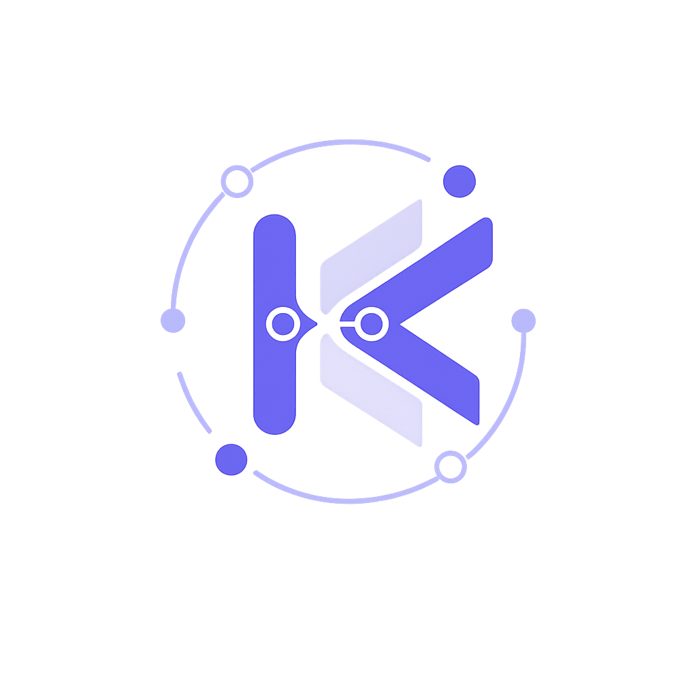
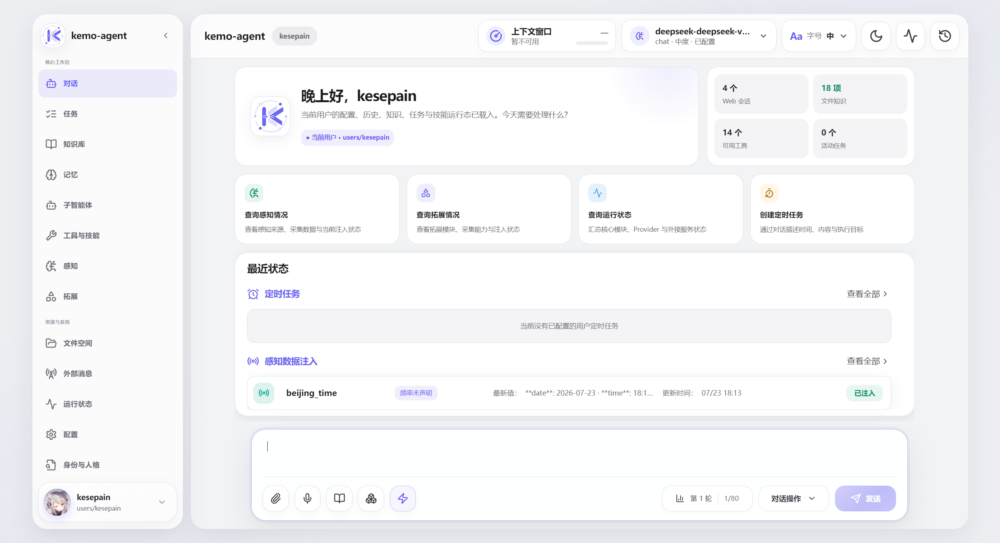

# kemo-agent

<p align="center">
  
</p>

<p align="center">
  <strong>简体中文</strong> · <a href="README_EN.md">English</a>
</p>

<p align="center">
  <strong>面向新一代个人智能基础设施的本地多用户 Agent Runtime。</strong>
</p>

<p align="center">
  以 Kemo Tidal Engram 潮汐式生命周期记忆系统为核心，统一编排上下文、子代理、工具、环境感知、外部扩展与跨平台交互，<br>
  使智能体具备长期认知、持续演化、复杂任务调度与现实世界连接能力。
</p>

<p align="center">
  <a href="https://github.com/kesepain-KE/kemo-agent"></a>
  <a href="LICENSE"></a>
  <a href="https://kesepain-ke.github.io/kemo-agent-doc/"></a>
</p>

---

## 如果每次对话都不必重新认识

很多智能助手只存在于当前窗口。

窗口关闭，关系也随之归零。你的偏好、正在推进的事情、曾经做过的决定，以及那些反复强调的重要细节，都可能在下一次见面时失去踪迹。

kemo-agent 想做另一种智能体。

它不把每次交流视为孤立的问答，而是把与你相处的时间连成一条延续的线。今天讨论过的目标，可以在明天继续；几周前留下的计划，可以在需要时重新被提起；那些真正重要的信息，会逐渐成为它理解你的背景。

它不是只会回答问题的窗口，更像是一间由你掌管的个人智能工作空间。

---

## 记忆如潮

人的记忆从来不是一座堆满原始记录的仓库。

有些话只在当时重要，潮水退去后便安静淡出；有些事情被反复提起，在一次次涨落中留下更清晰的痕迹；还有一些人与决定，即使经过很久，也依然值得被认真记住。

这正是 **Kemo Tidal Engram（潮汐记忆）** 想带来的体验。

kemo-agent 不追求机械地记住一切，而是希望在漫长的使用过程中，逐渐分辨什么与你有关、什么仍然重要、什么应当在恰当的时候重新浮现。

你也始终拥有查看、补充和修正记忆的权利。记忆不是隐藏在黑箱里的判断，而是你与智能体共同维护的一部分。

> 潮汐会带走短暂的回声，也会把真正重要的东西留在岸上。

---

## 它可以陪你做什么

| 场景 | kemo-agent 带来的体验 |
|---|---|
| 日常交流 | 延续你的表达习惯、偏好与长期关注点，不必反复交代背景 |
| 记忆沉淀 | 重要的信息自然留存、反复提及的加深印象、不再需要的安静淡出 |
| 复杂任务 | 把模糊目标整理为清晰计划，持续跟进步骤与结果 |
| 长期项目 | 保留关键决定、未完成事项与阶段变化，随时接续工作 |
| 定时守候 | 在约定时间执行任务、整理信息或发送提醒，你不在线时也会按时醒来 |
| 知识协作 | 使用属于个人或团队的资料，让回答贴近真实工作环境 |
| 深度思考 | 面对复杂问题时自动投入更多思考，简单问题则快速响应 |
| 子代理协作 | 把整理记忆、规划步骤、定时调度等专门判断交给擅长的子代理处理 |
| 外部连接 | 从网页、命令行或消息平台与同一位智能体保持联系 |
| 文件往来 | 接收用户资料，整理智能体生成的结果与临时文件 |
| 状态感知 | 汇集已授权的信息来源，让智能体了解当下环境 |
| 能力扩展 | 按需要增加新的工具、技能、感知来源与外部连接 |

这些能力并不是彼此孤立的功能入口。它们共同服务于同一个目标：让智能体能够理解正在发生什么，并把事情持续向前推进。

---

## 一处完整的个人智能工作台

kemo-agent 的网页端围绕真实使用过程组织，而不是只提供一个输入框。

你可以在其中：

- 与智能体进行流式对话，并在运行过程中追加文本、图片、音频、视频或文件引导；
- 搜索、切换、保存和管理历史对话；
- 查看与编辑记忆，维护长期认知；
- 管理个人、共享与全局知识；
- 创建、批准、暂停和继续任务计划；
- 安排一次性或周期性的定时任务；
- 查看工具、技能、感知来源与扩展能力；
- 管理上传文件、生成结果与临时内容；
- 检查外部消息连接和当前运行状态；
- 为不同用户保留彼此独立的资料与工作空间。

对话再长，也不需要一次加载全部历史。网页只呈现最近的内容，需要回顾时再向上加载，让长期交流保持轻盈。

<p align="center">
  
</p>

---

## 同一个智能体，不止一个入口

你可以在浏览器里与它长谈，也可以在命令行中快速处理本地事务，或从已经连接的消息平台发来一句话。

入口可以改变，但用户身份、历史关系、记忆与已授权资源仍然属于同一个人。kemo-agent 希望减少“换个平台就要重新认识一次”的割裂感，让智能体真正成为一个持续存在的个人入口。

定时任务同样属于这段连续关系。你不在线时，它仍可以在约定时间醒来，完成被托付的事情，并留下可回看的结果。

---

## 复杂的事情，也可以慢慢完成

面对多步骤目标，kemo-agent 可以先与你确认计划，再开始行动。

你能够看到任务正在推进到哪里、已经完成了什么、还剩下什么；也可以在执行途中暂停，重新考虑方向，再决定是否继续。

它强调的不是脱离用户控制的“全自动”，而是可理解、可干预、可继续的协作过程。

有些事情适合当场完成，有些事情需要跨越多轮交流，还有些事情应当留给未来某个时间。kemo-agent 尝试让这三种节奏自然地存在于同一处工作空间中。

---

## 属于你的数据，也应当由你掌管

kemo-agent 坚持本地优先。

对话、记忆、知识、任务与用户文件由你的工作空间管理，可以查看、备份和迁移。不同用户之间保持清晰边界，哪些资源能够被使用，也由用户自己决定。

项目不会承诺任何模型服务都天然私密。实际发送给外部服务的内容取决于你选择的服务、配置与授权范围。kemo-agent 所做的是把选择权和可见性尽可能交还给使用者。

---

## 开始体验

> 📖 完整的安装、配置、功能使用和扩展开发说明，请访问 **[kemo-agent 在线文档](https://kesepain-ke.github.io/kemo-agent-doc/)**。

### 环境要求

- Python 3.10+
- Node.js（用于前端构建）
- Git

### 获取并部署

```bash
git clone https://github.com/kesepain-KE/kemo-agent.git
cd kemo-agent
python setup.py
```

部署脚本会引导你完成依赖安装、环境配置、前端构建和用户创建。如果希望跳过交互，可以使用：

```bash
python setup.py --yes
```

部署完成后，启动网页端：

```bash
python start_web.py
```

默认访问：

```text
http://127.0.0.1:1357
```

如果更习惯命令行，也可以使用：

```bash
python cli.py
```

更新项目：

```bash
python update.py
```

> 初次使用建议从网页端开始。用户、对话、记忆、知识、任务和扩展能力都可以在同一界面中查看。

---

## 我们希望它成为什么

kemo-agent 并不试图成为一个无所不能、替用户做出所有决定的系统。

它更希望成为一种稳定的个人智能基础：

- 相处越久，越理解你的习惯与边界；
- 面对复杂任务时，先与你达成共识；
- 需要行动时，清楚展示过程与结果；
- 需要等待时，记得在未来继续；
- 能力不断增加，但控制权始终属于用户；
- 即使更换模型或连接方式，属于你的资料仍然可以留下。

真正长期的智能关系，不应依赖一次精彩的回答，而应来自无数次可靠、克制且连续的协作。

---

## 当前状态

当前版本：`1.0.1`

`1.0.0` 标志着 kemo-agent 主生态首次补齐并进入稳定主版本。`1.0.1` 是主生态补齐后的系统性稳定性版本，完成了核心运行链路、配置合同、插件与拓展边界、记忆与历史存储、Web API/前端适配、工具调用安全以及发布前测试工作流的全面复核。后续版本将以边缘生态扩展、兼容性、性能和长期可靠性优化为主。

目前可以体验的内容包括：

- 完整的网页对话界面，支持流式交互与运行中追加多模态引导；
- 每用户独立的 SQLite 历史库，支持事务提交、正文表检索和游标分页；
- 每用户独立的 SQLite 潮汐记忆库，正文、生命周期、每日加权证据和热画像来源统一事务化；只根据用户对话历史的可回溯原文命中加权，内容按周期晋级或淡出；
- 临时重要记忆作为可重建热画像独立维护，只由临时三层单向提炼，不会反向加权源记忆；
- 个人、共享与全局三层知识库，让回答贴近真实资料；
- 任务计划从创建、审批到逐步执行，可暂停、可继续、可回溯；
- 一次性和周期性定时任务，在约定时间自动醒来完成；
- 子代理协作：整理记忆、规划步骤、生成摘要、定时调度各有专人；
- 多个内置工具与技能，可按需扩展；
- Kemo 协议下根据网关模型能力动态展示思考档位，其他 Provider 协议继续使用原有配置方式；
- 普通插件工具使用非严格参数模式，兼容开放对象与可选字段，同时保留结构化输出工具的严格校验；
- Kemo 与 Chat 两条 Provider 链路都会在执行前校验工具参数完整性；Chat 输出截断、内容过滤或残缺 JSON 会明确结束为不完整响应，不会误执行半个工具调用；
- 技能、拓展、感知、外部消息路由、子代理和用户模板配有独立合同测试基准，便于验证创建结果的基础入口与出口协议；
- 用户技能支持从 Web 上传 ZIP，递归发现 `SKILL.md` 并以事务方式安全安装；
- 网页端、命令行、消息平台多入口，同一身份同一记忆；
- 多用户独立工作空间，彼此隔离，各自配置；
- 上传文件空间与智能体生成内容分开管理，并支持受限的图片、音频和视频预览；
- 记忆工具支持一次跨四个生命周期层级检索；长对话导航使用 10 项动态窗口，当前轮次固定旋转到 180°中心位，并可继续加载更早历史；
- Web 后端按路由、领域服务和公共契约分层，保留原有兼容入口；
- 运行状态与日常维护入口，后台任务自动运转。

仍在持续打磨的方向：

- 用户自定义扩展的创建体验——让它更直观、更少出错；
- 长时间连续运行下的稳定性与资源表现；
- 安装、更新和迁移流程的顺畅度；
- 面向更多真实场景的细节打磨。

如果你正在试用早期版本，欢迎提交遇到的问题、使用感受，以及你真正希望智能体替你承担的事情。

---

## 相关项目

- [votx-agent](https://github.com/kesepain-KE/votx-agent)  
  独立维护的 Agent 项目，与 kemo-agent 不存在继承关系。

- [kemo-adapter-api](https://github.com/kesepain-KE/kemo-adapter-api)  
  与 kemo-agent 配合使用的模型服务适配项目。

---

## 主要维护者

[@kesepain](https://github.com/kesepain-KE)

---

## 参与贡献

kemo-agent 仍处在非常早期的阶段。无论是问题报告、体验建议、文档改进还是功能贡献，都很欢迎。

推荐流程：

1. Fork 本仓库；
2. 创建自己的功能分支；
3. 完成修改并进行必要验证；
4. 提交 Pull Request，说明改变了什么以及为什么。

---

## 开源协议

本项目基于 [Apache License 2.0](LICENSE) 开源。
