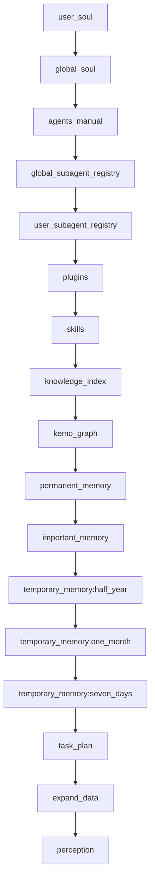

# 原理：PromptBundle 编排

对应源码：

- `E:\code\kemo-agent\run\prompt.py` — `PROMPT_SECTION_ORDER`、`build_prompt_bundle()`、`parse_prompt_settings()`
- `E:\code\kemo-agent\run\memory.py` — `MemoryStore.select_tier_for_prompt()`、`MemoryStore.mark_used()`
- `E:\code\kemo-agent\run\tools.py` — `discover_tools()`
- `E:\code\kemo-agent\run\knowledge.py` — `select_knowledge_index()`
- `E:\code\kemo-agent\run\prompt_sources.py` — `PromptSourceRegistry`
- `E:\code\kemo-agent\run\task_plan_store.py` — `select_prompt_plans()`
- `E:\code\kemo-agent\run\kemo_graph.py` — `load_kemo_graph_prompt_context()`
- `E:\code\kemo-agent\agents/_runtime/schema.py` — `discover_agents(root, user)`

## 结论

当前 `build_prompt_bundle()` 会按**固定 16 段顺序**组装最终 system prompt：

1. `user_soul`
2. `global_soul`
3. `agents_manual`
4. `global_subagent_registry` (新增)
5. `user_subagent_registry` (新增)
6. `plugins`
7. `skills`
8. `knowledge_index`
9. `kemo_graph` (六子层)
10. `permanent_memory`
11. `important_memory`
12. `temporary_memory:half_year`
13. `temporary_memory:one_month`
14. `temporary_memory:seven_days`
15. `task_plan`
16. `expand_data`
17. `perception`

> 注：第 4-5 段从旧版单一 `subagent_registry` 拆分而来，总段数从 14 增加到 16（PROMPT_SECTION_ORDER 含 17 个键，但 permanent_memory 段名固定为 "permanent_memory" 而非带 tier 后缀）。

## 固定顺序图



## 这轮最重要的变化

### 1. 子代理注册拆分

旧版单一 `subagent_registry` 段。新版拆为：
- `global_subagent_registry` — 内置子代理 (`source == "builtin"`)
- `user_subagent_registry` — 用户自建子代理 (`source == "user"`)

`discover_agents(root)` 发现全局，`discover_agents(root, user)` 发现用户级。

### 2. 知识索引 + 替换标记

被 kemo-graph 替换的 scope 不再从 knowledge_index 段中移除，而是保留独立段并注入固定标记文本：

```
# users/<user>/knowledge/ 目录结构，已被知识图谱替代
```

`_knowledge_index_prompt()` 函数统一处理所有 scope 的注入与替换标记。

### 3. 临时记忆 + 替换标记

被 kemo-graph 替换的三层临时记忆不再从 PromptBundle 中排除，而是保留独立段并注入固定标记文本：

```
# 用户的临时重要记忆，遗忘周期6个月，已被知识图谱替代
# 用户的临时重要记忆，遗忘周期一个月，已被知识图谱替代
# 用户的临时重要记忆，遗忘周期七天，已被知识图谱替代
```

所有 tier_specs 都参与循环，被替换的注入标记文本，未替换的走正常记忆选择。永久记忆和临时重要记忆始终保留。

### 4. kemo_graph 六子层

旧版 `KemoGraphPromptContext` 为单一对象（requested/connected/status/text 四字段）。新版改为 `layers: tuple[KemoGraphLayerStatus, ...]`，六个独立子层各有自己的名称、开关、状态和文本。

### 5. 诊断增强

- `knowledge_replaced_scopes` 加入 diagnostics
- kemo_graph 的 original_items / injected_items 基于 layers 计数

## PromptBundle 结构

### PromptBundle 核心字段

```python
@dataclass
class PromptBundle:
    sections: list[PromptSection]    # 固定顺序段落
    total_chars: int
    diagnostics: dict
    memory_files: tuple[str, ...]   # 注入的记忆文件
    memory_ids: list[str]           # 临时层文件名（不含永久层）
```

### 空段填充

缺失的 section 填充为 `PromptSection(name=..., content="(无)")`。section 列表始终保持完整 16 段。

## 每一段分别是什么

### 1. user_soul / global_soul / agents_manual

基础人格与框架规则底座。

### 2. global_subagent_registry / user_subagent_registry

框架内置子代理和用户自建子代理的注册摘要。详细操作信息位于对应 `trigger.md`。

### 3. plugins / skills

来自 `plugins/*/SKILL.md` 的插件描述 和 注册的共享/用户技能描述。

### 4. knowledge_index

`select_knowledge_index()` 选择各层索引文件。被替换的 scope 注入标记文本。

### 5. kemo_graph

六子层检索结果或"已启用但未连接"状态。每层独立报告。

### 6. permanent_memory / important_memory / temporary_memory:*

四档分档记忆注入。被替换的临时记忆注入标记文本。永久记忆和临时重要记忆始终保留。

### 7. task_plan / expand_data / perception

任务计划、拓展模块注入文件、感知文件。

## 约束和校验

### 1. 顺序强校验

`build_prompt_bundle()` 最后检查实际顺序是否和 `PROMPT_SECTION_ORDER` 一致。

### 2. 长度控制

- 临时记忆文件数限制：`temporary_memory_limits`
- 重要记忆字符限制：`important_memory_max_chars`
- 字符数限制：`char_limits`
- 注入模式限制：`injection_mode`
- 全局记忆开关：`memory.injection_enabled`

### 3. 诊断信息完整

`PromptBundle.diagnostics` 记录总字符数、section 顺序、截断情况、knowledge 文档列表、knowledge_replaced_scopes。

## 相关笔记

- [[原理-总览]]
- [[原理-运行原理]]
- [[原理-系统提示词拼接]]
- [[原理-工具调用]]
- [[原理-记忆升级权重]]
- [[原理-感知与拓展]]
- [[原理-上下文管理]]
- [[run-prompt]]
- [[run-kemo_graph]]
- [[run-source_policy]]