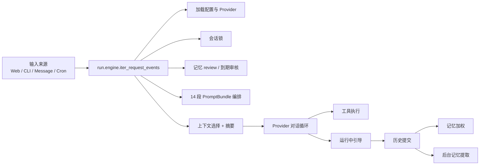

# 原理 — kemo-agent 源码原理群

`E:\code\kemo-agent\开发临时目录\obsidian\原理/`

这个知识群只记录**当前源码实际实现**，不把旧文档口径当事实。

## 结构总览

| 笔记 | 主题 | 对应源码 |
|---|---|---|
| 原理-PromptBundle编排 | 14 段 PromptBundle、工具 manifest、感知/拓展/知识/记忆全链路 | `run/prompt.py` `run/tools.py` `run/knowledge.py` `run/memory.py` `run/task_plan_store.py` `run/prompt_sources.py (ExpandSelection)` `run/prompt_sources.py (PerceptionSelection)` |
| 原理-运行原理 | 用户提问后，整个智能体如何跑起来 | `run/engine.py` `run/history.py` `run/context.py` `run/context_summary.py` `run/memory.py` `run/knowledge.py` `run/tools.py` |
| 原理-记忆升级权重 | 记忆如何注入、加权、升级、删除（schema v2 文件型） | `run/memory.py` `run/memory_pipeline.py` `run/memory_migrate.py` `run/engine.py` |
| 原理-工具调用 | 工具如何发现、校验、执行、回传 | `run/tools.py` `run/engine.py` `run/task_plan_executor.py` |
| 原理-消息路由 | 外部消息如何映射到内部用户并进入运行核心 | `message/router.py` `message/identity.py` `message/transport.py` `run/runtime_host.py` |
| 原理-上下文管理 | 历史窗口、摘要、token 预算、压缩如何工作 | `run/history.py` `run/context.py` `run/context_summary.py` |
| 原理-定时任务 | Cron 如何扫描、领取、执行、回写 | `cron/scheduler.py` `cron/executor.py` `run/cron_store.py` `run/runtime_host.py` |
| 原理-计划任务 | 任务计划如何生成、审批、逐步执行 | `run/task_plan_service.py` `run/task_plan_executor.py` `run/task_plan_store.py` |
| 原理-感知与拓展 | 感知注册、知识检索、拓展接入现状 | `run/prompt_sources.py`（`PromptSourceRegistry.select_expand/select_perception`） `run/knowledge.py` `web/service.py` |

## 总体主链路

## 当前实现边界

- **系统提示词**：已升级为 14 段 `PromptBundle` 编排。
- **运行核心**：所有入口最终都收敛到 `run.engine`。
- **记忆**：以"到期审核 + 使用加权 + 异步提取"为主，支持 v1→v2 迁移。
- **工具**：只执行插件 `SKILL.md` 注册的显式工具。
- **消息路由**：按绑定身份和会话锁串行处理。
- **感知/拓展**：`knowledge_index / expand_data / perception` 已进入 prompt。
- **子代理体系**：基于 agent.json（精简/完整双模式）+ agent-config.json（v2）的子代理注册表，新增 trigger.md 触发注册系统。内置子代理使用 `executor.py:execute`，用户子代理仅允许 `builtin:llm`。
- **Trigger 注册系统**：每个子代理目录下的 trigger.md 定义触发场景、职责、模型和编排规则，注册信息自动注入 AgentDefinition.trigger_registration。
- **后台维护**：独立于 cron 的 MaintenanceScheduler，处理记忆审阅和上下文压缩；新增 cron/review_due.py 定期触发 memory_temporary_important 记忆审阅。
- **资源准入**：SourcePolicy 控制主 agent 的插件/技能/拓展/感知白名单。
- **知识图谱替换**：kemo_graph.py 边界允许外部项目替换本地知识索引和记忆。
- **感知/拓展标准化**：感知和拓展模块从旧有的代码注册改为 JSON 元数据驱动（SenseMeta / ExpandMeta），支持 JSON schema 校验和实例目录（global_sense/example/、global_expand/example/）。
- **知识库重构**：knowledge.py 简化，移除评分/排序系统，采用索引全量化 + 确定性注入策略。

## 阅读顺序建议

1. 原理-PromptBundle编排
2. 原理-运行原理
3. 原理-上下文管理
4. 原理-工具调用
5. 原理-记忆升级权重
6. 原理-消息路由
7. 原理-定时任务
8. 原理-计划任务
9. 原理-感知与拓展
